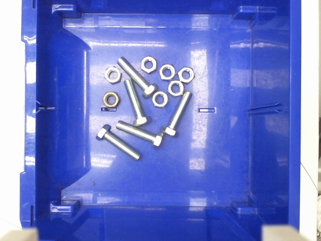
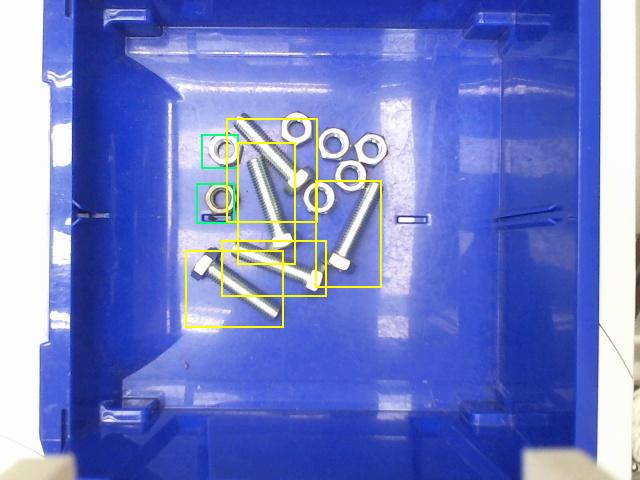

# Object Detection For Classification Screw and Nuts


Image identification screws and nuts, 
the left side is the identified original image, and 
the right side is the result found using faster rcnn method.

<p>


</p>

## Need to install python module

*   opencv-python
*   Pillow
*   PyQt5
*   Numpy
*   Tensorflow

It's just example to classification.

### Will add how to use and how it's work

# Installation

* tensorflow-gpu (tensorflow-cpu)
* keras
* python>=3.6 (use the new formate f'{}')

# tensorflow-gpu install

  1. Install [Anaconda](https://www.anaconda.com/distribution) (can save a lot of time)
  2. setup a virtual Environment using conda [reference](https://www.anaconda.com/tensorflow-in-anaconda/)
```sh
conda create -n tensorflow_gpuenv tensorflow-gpu
conda activate tensorflow_gpuenv
```
if using in cpu-version using
```sh
conda create -n tensorflow_env tensorflow
conda activate tensorflow_env
```
  3. Checking tensorflow have install already.
```sh
import tensorflow as tf
print(device_lib.list_local_devices())
```

You can also install by pip:
  - install cuda 9.0
  - install cudnn 9.0
  - add the following path in your Environment.
  - using pip to install tensorflow
```sh
pip install tensorflow-gpu
```


Download trained neural network and unzip to folder [neural_network](https://drive.google.com/open?id=1ZD05a7JMtfBm69fDatRUSLIaQKcVES9g)

  - /core

Use the press button to find the image "test.jpg" nuts and screw.